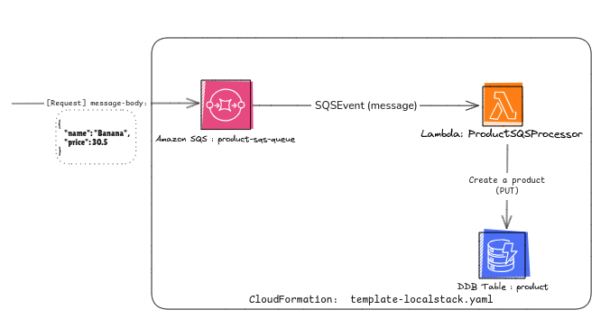

# Project: Product Lambda Sample

## Overview
This project demonstrates deploying and interacting with an AWS Lambda function integrated with S3, SQS, and DynamoDB, running on LocalStack. Follow the steps below to set up, deploy, and use the project.



---

## Prerequisites
Ensure the following tools are installed:

- **AWS CLI v2**
- **Java 17** (Install via [SDKMAN](https://sdkman.io/) or use the deploy script)
- **Maven**
- **Docker Compose**

---

_## Getting Started

### Step 1: Configure AWS CLI for LocalStack
Set up a LocalStack profile for AWS CLI:

```bash
aws configure set aws_access_key_id "key" --profile localstack
aws configure set aws_secret_access_key "secret" --profile localstack
aws configure set region "eu-west-1" --profile localstack
aws configure set output "json" --profile localstack
```

### Step 2: Start Docker Containers
Run the following command from the project's root directory to start the LocalStack containers:

```bash
docker compose -f localstack-compose.yaml up
```

---_

### Step 3: Deploy the Application

#### Option 1: Automatic Deployment Using Shell Script
1. Make the deployment script executable:

   ```bash
   chmod +x deploy-localstack.sh
   ```

2. Run the script:

   ```bash
   ./deploy-localstack.sh
   ```

#### Option 2: Manual Deployment
1. Build the project:

   ```bash
   mvn clean package
   ```

2. Create the deployment S3 bucket:

   ```bash
   aws --endpoint-url=http://localhost:4566 --profile localstack s3 mb s3://artifact-storage-bucket
   ```

3. Upload the JAR file to the LocalStack S3 bucket:

   ```bash
   aws --profile localstack --endpoint-url=http://localhost:4566 s3 cp target/product-lambda-0.0.1-SNAPSHOT.jar s3://artifact-storage-bucket/product-lambda-0.0.1-SNAPSHOT.jar
   ```

4. Deploy AWS resources to LocalStack using CloudFormation:

   ```bash
   aws --profile localstack --endpoint-url=http://localhost:4566 cloudformation deploy \
     --template-file template-localstack.yaml --stack-name product-lambda-sample
   ```

---

### Step 4: Interact with the Application

#### Send Data to SQS Queue
Send a message to the SQS queue to trigger actions:

```bash
aws --profile localstack --endpoint-url=http://localhost:4566 sqs send-message \
  --queue-url http://sqs.eu-west-1.localhost.localstack.cloud:4566/000000000000/product-sqs-queue \
  --message-body '{ "name": "Banana", "price": 10.5 }'
```

#### Scan DynamoDB Table Data
Retrieve data from the DynamoDB table:

```bash
aws --profile localstack --endpoint-url=http://localhost:4566 dynamodb scan --table-name product
```

---

### Resource Tracking Commands
Use these commands to monitor and manage your resources:

#### CloudFormation
- Describe stack events:

  ```bash
  aws --profile localstack --endpoint-url=http://localhost:4566 cloudformation describe-stack-events \
    --stack-name product-lambda-sample
  ```

#### S3
- List all S3 buckets:

  ```bash
  aws --profile localstack --endpoint-url=http://localhost:4566 s3api list-buckets
  ```

#### DynamoDB
- List DynamoDB tables:

  ```bash
  aws --profile localstack --endpoint-url=http://localhost:4566 dynamodb list-tables
  ```

#### SQS
- List SQS queues:

  ```bash
  aws --profile localstack --endpoint-url=http://localhost:4566 sqs list-queues
  ```

- Get queue attributes:

  ```bash
  aws --profile localstack --endpoint-url=http://localhost:4566 sqs get-queue-attributes \
    --queue-url http://sqs.eu-west-1.localhost.localstack.cloud:4566/000000000000/product-sqs-queue \
    --attribute-names All
  ```

#### Lambda
- Get Lambda function details:

  ```bash
  aws --profile localstack --endpoint-url=http://localhost:4566 lambda get-function \
    --function-name ProductSQSProcessor
  ```

---

### Cleanup: Drop Docker Containers
Run the following command from the project's root directory to clean the LocalStack containers and docker volumes:

```bash
docker compose -f localstack-compose.yaml down -v
```

---

## Notes
- Ensure LocalStack is running before executing any AWS CLI commands.
- Modify configurations as necessary to match your local setup.
